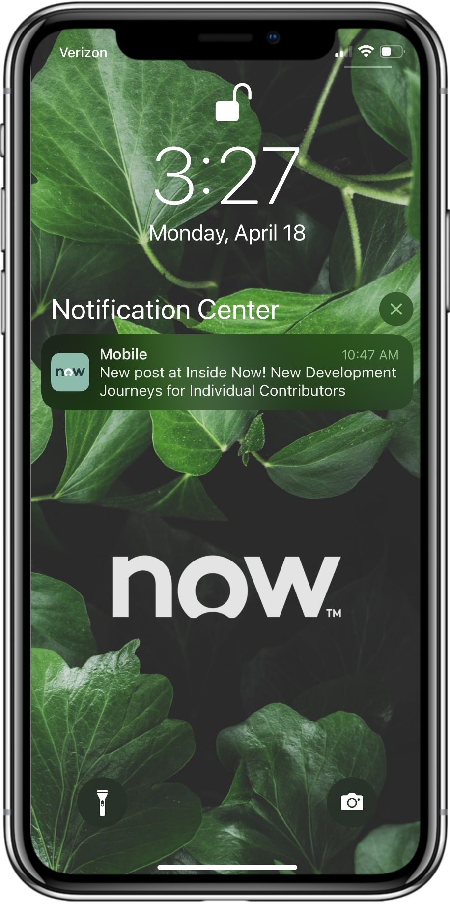

 
# Lab Guidebook: Bring ServiceNow to life in your iOS app! A beginner's guide to the Mobile SDK

# 🔰 Getting Started

Does your company have a custom iOS application and you're wondering how it can access ServiceNow® data & workflows? Do you want to build one but don't know what's possible/where to start? See first-hand in this lab how the Mobile SDK accelerates iOS app development by building an app from scratch – no prior iOS development experience required!

Create the experience you want, natively in your own app.

## About the Mobile SDK
The ServiceNow Mobile SDK is a library that native mobile application developers can use to make it easier to interact with a ServiceNow instance. Versions of the SDK exist for both iOS and Android.

On top of managing authentication with a ServiceNow instance, as of writing the SDK consists of 5 primary components:

## NowData 
NowData facilitates leveraging existing ServiceNow data in your application & performing actions on it.

It supports:

- Querying and mutating data on an instance, directly from your own app.
- Utilization via REST and/or GraphQL.

## NowChat 
NowChat enables developers to leverage ServiceNow's native Virtual Agent within their own app.

It includes:

- Native UI components for Virtual Agent or Live Agent conversations.
- Design and conversation builder for Virtual Agent topics.
- Allow opening URLs in the host app from the Virtual Agent client.
- Ability to configure the interface's theme to blend in with the design of the host app.

## NowWeb 
NowWeb offers support for placing embedded authenticated ServiceNow webpages into your app. For example, you can embed Service Portal pages, Experiences built in UI Builder etc.

By leveraging NowWeb, developers will be able to:

On the instance:

- Create and leverage ServiceNow webpages, such as portals.

On the client:

- Render these portal pages without requiring additional authentication for your mobile end users.

## NowPush 
NowPush allows developers to configure custom push notifications using ServiceNow's Mobile Platform push notification framework. 

Using NowPush, developers will be able to do the following:

On the Instance:

- Create ServiceNow Push Notifications based on specific data conditions on their instance•

On the Client:

- End users will be able to receive these native push notifications with the content that’s configured on the ServiceNow instance

## NowAnalytics 
ServiceNow has its own analytics product on the platform called, User Experience Analytics (UEA). 

NowAnalytics allows developers to create their own mobile events, and metrics that can be captured within their app, and sent directly to the ServiceNow UEA product.

These custom mobile KPIs can then be tracked on the platform, along with any other desired platform analytics. 

With NowAnalytics, developers can do the following:

Within your mobile app:

- Define custom events to track user behavior

Within the platform analytics dashboard:

- Create event-based and action-based analytics reports
- Get session and user analytics
- Get usage metric
- Get UI Analysis
- Get dashboard views for monitoring key performance indicators

> [!NOTE] 
> Please reach out to ServiceNow Customer Support if you are interested in using the NowAnalytics SDK.

## Lab Goal
The goal of this lab is to enable you to understand what's possible with the Mobile SDK, and how it allows you to easily access many elements of the Now Platform from an iOS application with a low degree of effort.

It is also to offer those with little to no experience with iOS & Swift development a jumpstart guide, giving them a base knowledge to begin creating native applications that are integrated with ServiceNow.

In the core part of the lab will be creating an simple example iOS application called "Hengtan Mobile" which has the following features:

- Single sign-on authentication across mobile app & ServiceNow instance. (SSO will be supported by Auth0)
- Retrieve and show incidents
- Embedded Virtual Agent chat functionality
- Showing a Service Portal page in the app

## Prerequisites
This workshop is intended for software development professionals who are familiar with basic programming concepts like variables, classes, web requests, and web authentication, however it is written in a step-by-step way that can be followed by anyone.

You will need Washington DC-or-later release ServiceNow instance with admin access, and the [Mobile SDK](https://store.servicenow.com/sn_appstore_store.do#!/store/application/52821846803120101040fe43e5b9ee8c/2.0.0) and [Glide Virtual Agent](https://docs.servicenow.com/bundle/tokyo-servicenow-platform/page/administer/virtual-agent/task/activate-virtual-agent.html) plugins installed.

It will greatly benefit participants to have a solid understanding of **ServiceNow System Administration**.

iOS application development is done using Apple's **Xcode** and the **Swift** programming language. Previous knowledge of this language is not necessary to complete this lab.

A computer running MacOS is required as iOS development can only be done on MacOS.

Publishing iOS applications to the Apple App Store requires a paid Apple Developer account, however this will not be necessary for this lab.

Running the application on your personal iOS device requires you to sign in to your personal Apple ID in Xcode. Running the application in the Simulator does not require sign in.

At the end of this lab there are links to further resources where you can continue your learning on the above topics.

## Required Lab Files
The below files will be required during the lab.

| Description | Download |
|---|---|
| Mobile SDK scoped application that can be loaded onto a ServiceNow instance | [ServiceNow Store](https://www.example.com)  |
| The ServiceNow Mobile SDK for iOS itself that you will use in Xcode. | [Mobile SDK Libraries - iOS \| ServiceNow Store](https://store.servicenow.com/sn_appstore_store.do#!/store/application/1539a1f087ea3014970e2178cebb3564) |

## Lab Instructions

This lab is broken into multiple sections, which must be followed in the order listed below. You can use the "Next Section" buttons at the bottom of each section to proceed through the lab in the correct order.
### 1 – [Xcode Basics](01-xcode-basics.md)

### 2 – [Instance Authentication & SDK Connection](02-instance-authentication-connection.md)

### 3 – [Frameworks, Libraries, & Packages](03-frameworks-libraries-packages.md)

### 4 – [Login Screen](04-login-screen.md)

### 5 – [Connect To & Show Data](05-connect-show-data.md)

### 6 – [Add Virtual Agent](06-add-virtual-agent.md)

### 7 – [Embed Service Portal](07-embed-service-portal.md)
### 8 – [Further Resources](08-further-resources.md)