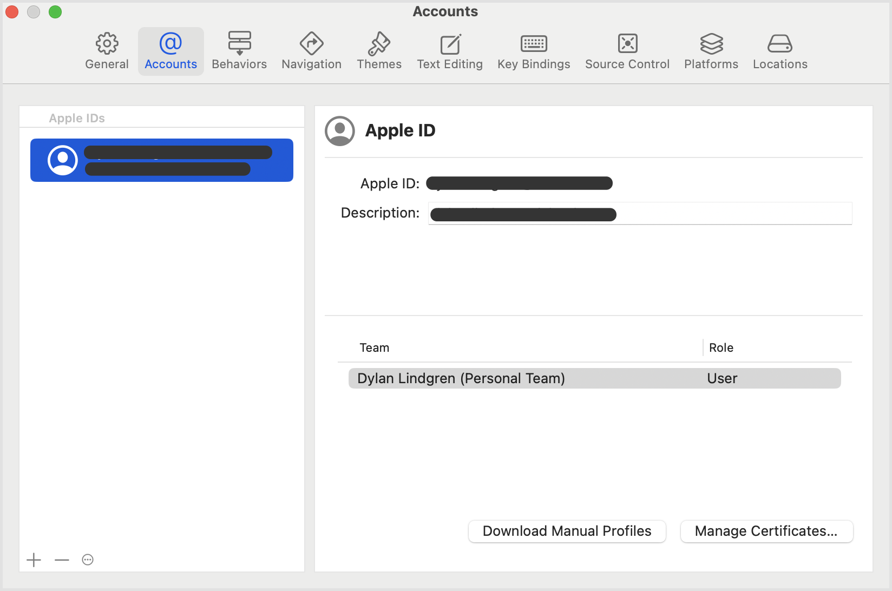
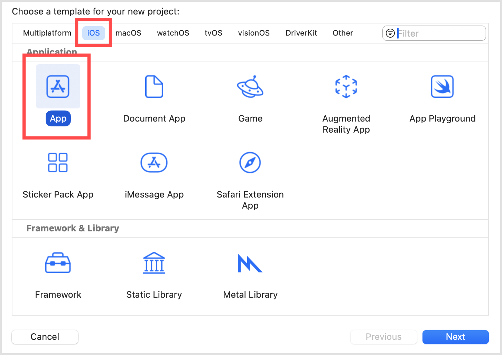
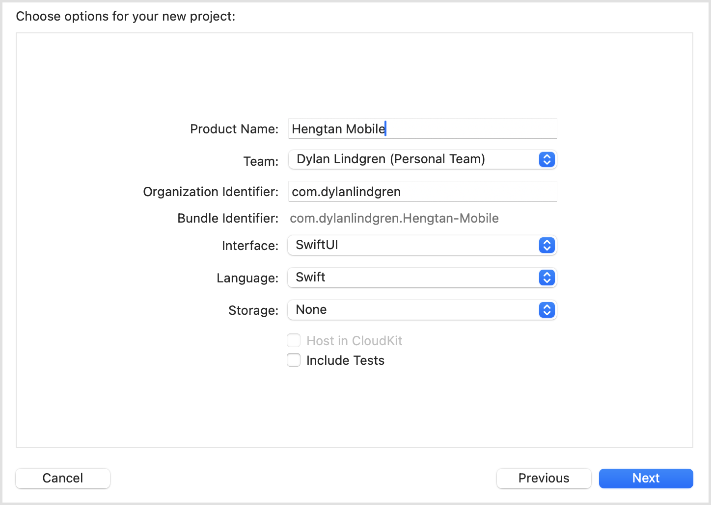
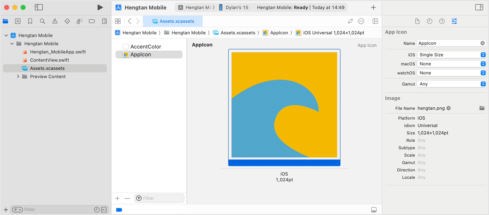
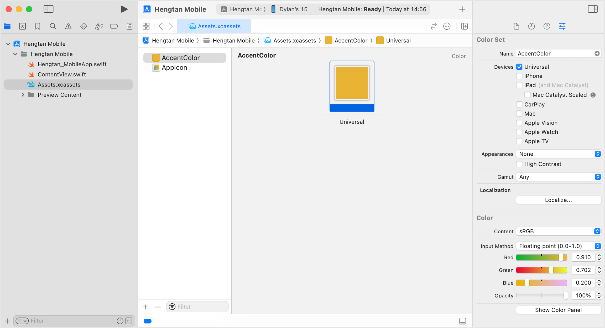
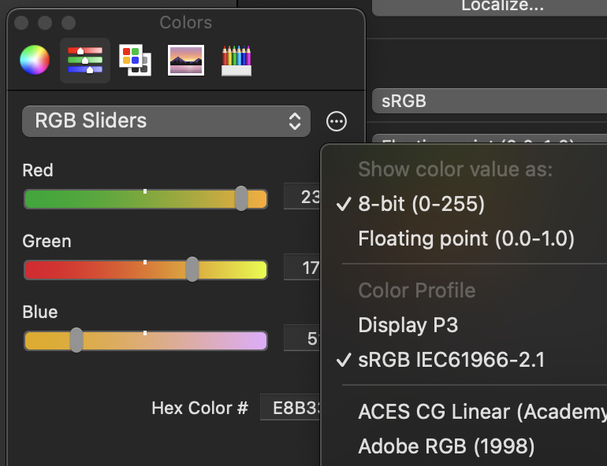
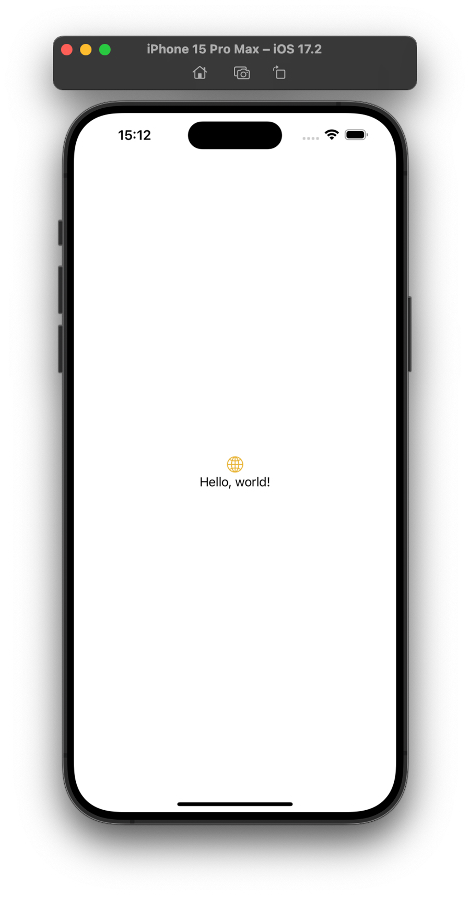
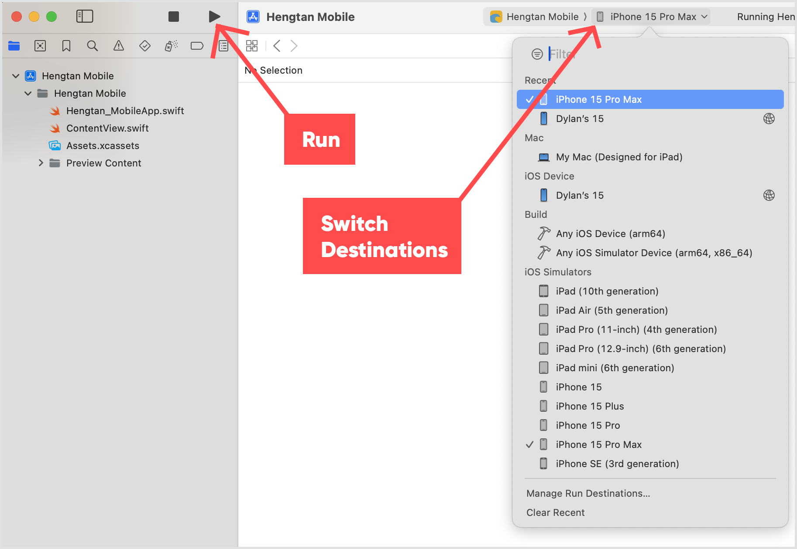

# Exercise 1: Xcode Basics
Xcode is a free application built by Apple allowing developers to create applications for many types of Apple devices, such as iPhones, iPads, Apple Watch, Apple TV, Apple Vision Pro, and even multi-platform applications. It is only available on MacOS.

When developing iOS applications, you'll primarily be using Xcode itself, but you will also be using another application it comes with called Simulator. As the name suggests, this application allows you to simulate many different types of Apple devices. This is extremely handy, as without it to test your application properly you'd need to buy one of each size & type of Apple device. That could get rather expensive! 💰😰

## 1.1 – Installation
> [!WARNING] 
> Xcode and the associated simulator runtimes have a very large file size – over 10gb!  
> It's recommended if attending this lab at an in-person event to perform this install step prior to attendance. It may take a long time to download and install, especially if many attendees are also installing at the same time!

1. On your Mac, open the **App Store**.

2. Search for **Xcode**.

3. Press **Install**.

4. Wait until the installation completes.

> [!NOTE]  
> If prompted, ensure that iOS is selected as a platform you want the simulator runtime installed for.  
> If you've already installed Xcode and you want to check this is done, from the Xcode menu bar you can choose Xcode > Settings... and look at the Platforms tab to see e.g. iOS 17.4

## 1.2 – Configuration
These steps will allow you to install your application on your personal iOS devices without requiring an Apple Developer account.

1. Open **Xcode**.
2. Choose **Xcode** > **Settings...** from the Xcode menu bar.
3. In the **Accounts** tab, press the **[+]** button, choose **Apple ID**, and sign in with your personal Apple ID.

4. Close the Settings dialog.

## 1.3 – App Creation
1. Choose **File** > **New** > **Project...** from the Xcode menu bar.
2. Ensure the **iOS** toggle button is selected at the top of the window.
3. Choose **App**, and click **Next**.

4. Complete the form as follows:

| Field | Value |
| --- | --- |
| Product Name | Hengtan Mobile |
| Team | By signing in with your Apple ID in step 1.2 this will have created a "Team" based on your Apple ID. For example, `Dylan Lindgren (Personal Team)`. |
| Select it for this application so you can run it on your personal iOS devices and not just in the Simulator. | Organization Identifier |
| Any unique name. This will typically be set to a domain name you control, but in reverse. | Feel free to base it on your personal domain name, or your company's domain name. For example, `com.dylanlindgren`. |
| Bundle Identifier | The Product Name and Organization Identifier fields will be combined to automatically complete this field.  This Bundle Identifier is important if you plan to publish to the Apple App Store, as it must be unique across all applications in the App Store.  Once published, no other applications can be published with the same one (although you can publish new versions of it).  This will also be important when we setup the app's authentication. | 
| Interface | SwiftUI |
| Language | Swift |
| Storage | None |
| Include Tests | *`(unselected)`* |

5. Click **Next**.

6. Choose a location on your computer to save the project in.

> [!NOTE] 
> Xcode will automatically create a subfolder in this directory with the name of your project name (e.g. "Hengtan Mobile" in our case).  
> Standard practice is to place Xcode projects within the "Developer" directory in your home directory e.g. /Users/dylan.lindgren/Developer.

7. Uncheck the **Create Git repository on my Mac** checkbox.

8. Click **Create**

The project will open automatically.

## 1.4 – App Branding
While there are many things we can do to brand our app, the two we will use for our app are its icon, and it's accent color.

First, download the icon we will use for the app.

// TODO: DOWNLOAD LINK

> The application icon for our "Hengtan Mobile" app.
1. From the project navigation tree on the left side of the window, choose the automatically-created **Assets.xcassets** file.
2. Select **AppIcon**, and click on the **1024x1024px** area in the middle to reveal options on the right-side of the window. (Choose **View** > **Inspectors** > **Show Inspector** if you don't see this)
3. Click the folder icon next to the **File Name** field and select the **hengtan.png** file.

4. Select **AccentColor**, and click on the **Universal** area in the middle to reveal options on the right-side of the window.

5. Click the **Show Color Panel** button, and enter the value `E8B333` into the **Hex Color** field.

> [!NOTE] 
> If you don't see the Hex Color field, ensure you have Show color value as set to 8-bit.
> 

## 1.5 – Running the Application
Xcode's Simulator application comes with a number of devices able to be simulated. iOS applications can be run on multiple different devices with various sizes, aspect ratios, and pixel density. It's important to test your application across various devices to ensure it works as expected.

For the purposes of this lab, we will be simulating our app running on an iPhone 15 Pro Max.

1. From the Xcode menu, choose **Product** > **Destination** > **iPhone 15 Pro Max**.
2. From the **Xcode** menu, choose **Product** > **Run**.

The Simulator application will start automatically, and after a few moments you will see your application launch inside a simulated iPhone 15 Pro Max. You might see a blank white screen for a bit, but please be patient! 😇

At the moment, the application just displays the message "Hello World" with a globe icon above it.

You can also choose a destination using the destinations dropdown, and run the application in the simulator by pressing the  button.

