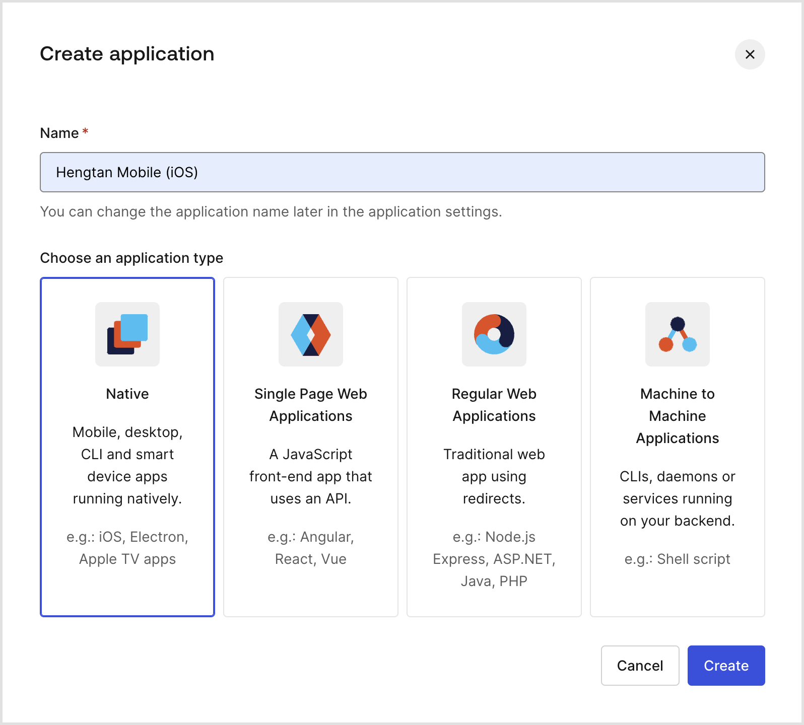
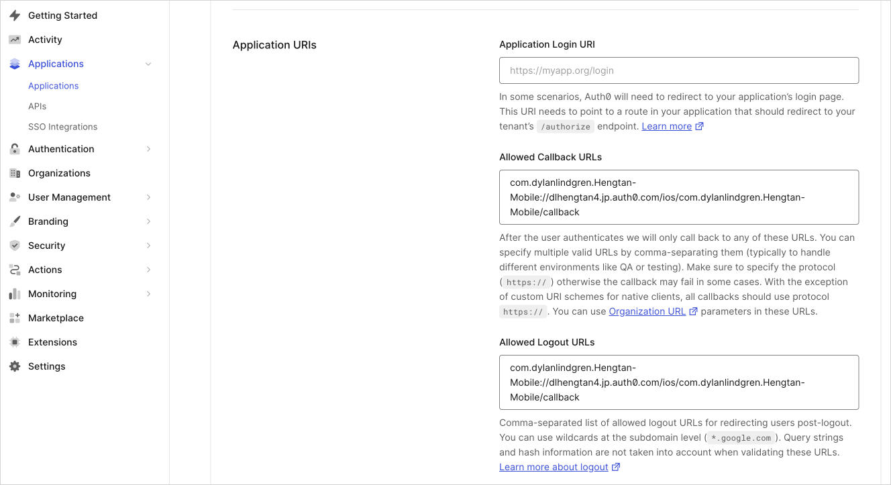
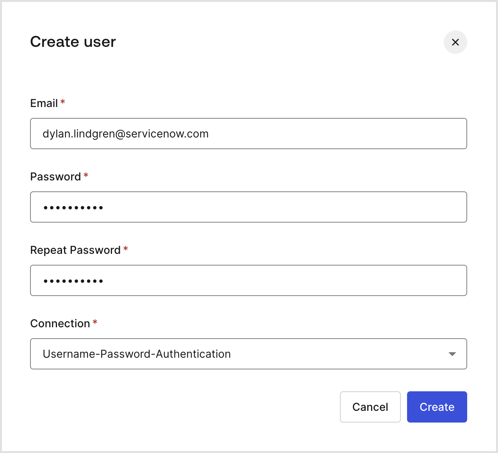
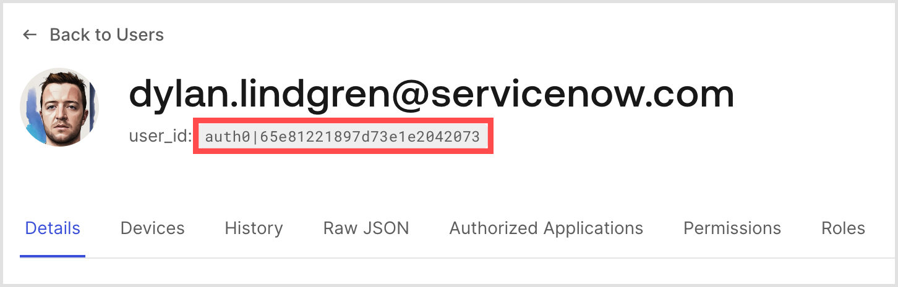
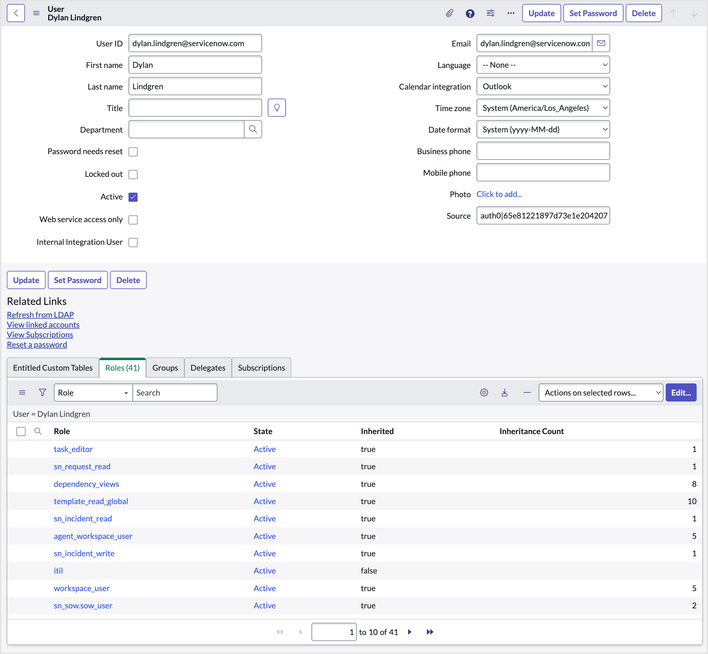
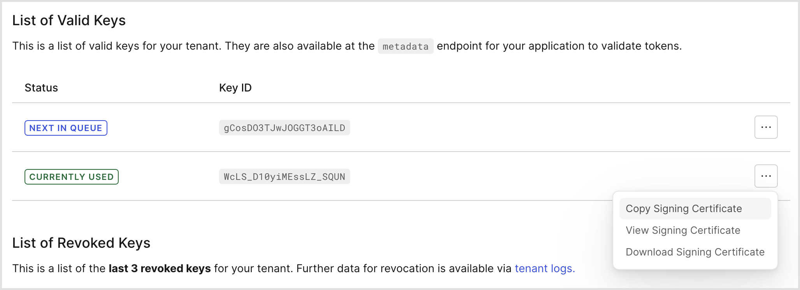
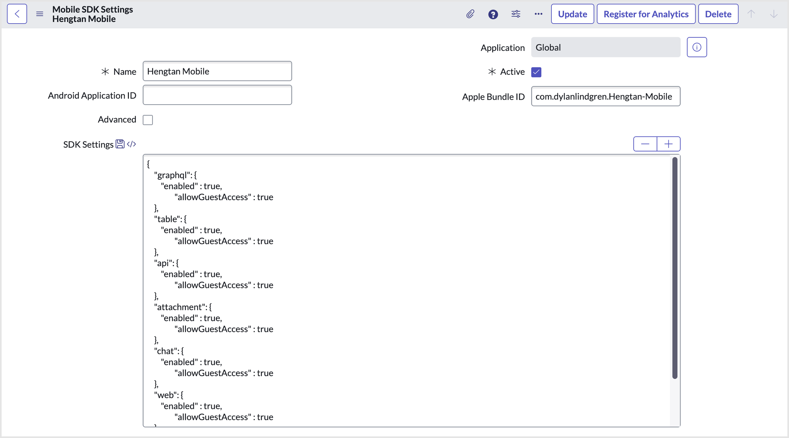

# Exercise 2: Instance Authentication & SDK Connection
Typically an organization that has a native mobile app will have some sort of single sign-on solution. This will allow for example one username and password to be used to sign on across all their services such as an iOS native mobile application, an Android native mobile application, and their website.

In our case, we want each user to have a single username and password that can log them in to our iOS application, as well as the ServiceNow instance.

Authentication is probably one of the most complex, and potentially dangerous parts of an application to develop. It is almost always best to defer that complexity to a third party solution whose job it is to understand that complexity. That way we can focus on building the things that differentiate our app, rather than reinventing the wheel and potentially creating a security vulnerability in the process.

In our case, the third-party solution we will use is [Auth0](https://auth0.com/) (a subsidiary of Okta).

The Mobile SDK authenticates to the ServiceNow instance using what's called a JWT token (often pronounced as a "jot token"). When the user signs on to the app using Auth0, they app can be provided with a JWT token signed by Auth0 that contains a number of claims (e.g. "I am john smith, and I am an admin user"). The ServiceNow instance can be configured to trust claims made by Auth0, meaning the Mobile SDK can then provide this JWT token to the ServiceNow instance to automatically log onto it based on the claims within it.

## 2.1 – Signup for an Auth0 Trial
1. Navigate to [https://auth0.com/signup](https://auth0.com/signup) and create an account.
2. When prompted, choose **Personal** or **Other** as the account type, select **I need advanced settings**, and click **Next**.
3. As the **Tenant Domain**, set it to anything you like. Ideally something meaningful, and readable, and of course unique. For example, `dl-hengtan4.jp.auth0.com`.
4. Choose a region based on your geographic location. For example, **Japan**.

> [!NOTE]
> Your tenant domain will be made up of the name you choose, with the domain suffix of whatever your geographic region is. For example, for the Japan region the suffix will be `jp.auth0.com`.

## 2.2 – Create a Native Application in Auth0
1. In the Auth0 management interface, choose **Applications** > **Applications**.
2. Click the **Create Application** button.
3. Choose a name for the application. For example, **Hengtan Mobile (iOS)**.
4. Select **Native** as the application type, and click **Create**.

<br />
The Create application dialog in Auth0.

5. In the page that loads, switch to the **Settings** tab.

> [!NOTE]
> To get to this settings screen manually, choose **Applications** > *[the native app you created]* > **Settings**.

Set both the **Allowed Callback URLs** and **Allowed Logout URLs** fields using the below format, replacing the `BUNDLE_IDENTIFIER` and `AUTH0_TENANT_DOMAIN` placeholders with the values relevant to your Xcode project and Auth0 account:

```
BUNDLE_IDENTIFIER://AUTH0_TENANT_DOMAIN/ios/BUNDLE_IDENTIFIER/callback
```

6. The **Bundle Identifier** of my iOS application is `com.dylanlindgren.Hengtan-Mobile`, and my **Auth0 Tenant Domain** is `dl-hengtan4.jp.auth0.com`, so I set these fields as per the screenshot below.

<br />

7. Click **Save Changes** at the bottom of the page.

## 2.3 – Create User Accounts
Auth0 will be our identity provider, and so we need to create a user account in our Auth0 management interface for us to log onto it with as a regular user.

We also need a corresponding user account in our ServiceNow instance which that regular user will use when interacting with the instance.

1. In the Auth0 management interface, choose **User Management** > **Users**.
2. Click **Create User**.
3. Enter an **Email** and a **Password**. Make note of these details as these will be the credentials we will log onto the mobile app with.
4. Leave the **Connection** field set to **Username-Password Authentication** and click **Create**.

<br />
The **Create user** dialog in Auth0.

5. Make a note of the `user_id` automatically created for this user, which is the unique ID that allows the correlation of separate user accounts in each system with each other.

    It will start with `auth0|`, followed by a number of hexadecimal characters, and will appear in the position shown in the screenshot below on the user account page.

<br />
The `user_id` automatically generated for the Auth0 user account.

6. In your ServiceNow instance, navigate to **User Administration** > **Users**.
7. Click **New**, and set the fields as follows:

| Field | Value |
| --- | --- |
| User ID | This can be set to anything, but you might want to set this to the email address of the account you created in Auth0. |
| Email | This can be set to any email address, but a good idea is to set this to the email address of the account you created in Auth0. |
| First name | The first name of the user. |
| Last name | The last name of the user. |
| Source | The `user_id` Auth0 automatically gave to the user you created in it. For example, `auth0|65e81221897d73e1e2042073` |

> [!NOTE]
> The Source field is not included in the default view on an out of box instance. You can use Form Layout to add it (right-click the form header, and choose **Configure** > **Form Layout**).

> [!NOTE]
> Although for this lab we're provisioning the user in ServiceNow manually, in production some other provisioning method would be used to ensure that this user is automatically created in ServiceNow with the appropriate permissions. For example, an integration with Auth0.

8. Click **Submit**, then in the **Roles** related list grant the `itil` role to the user.

> [!NOTE]
> The Mobile SDK supports guest users, however to make full use of all the features we will grant this `itil` role to our user.

<br />
The user account created in the instance, with the `itil` role and the **Source** field set.

## 2.4 – Create an OAuth JWT API endpoint for external clients
1. In the Auth0 management interface, choose **Settings** and then change to the **Signing keys** tab.
2. Scroll down to the **List of Valid Keys** section, press the button to the right of the key listed as "Currently Used", and choose **Copy Signing Certificate**.

<br />
Copying the signing certificiate from the **List of Valid Keys** section of the settings page.

3. In your ServiceNow instance, navigate to **System Definition** > **Certificates**, and click **New**.
4. Complete the **Name** field (e.g. "Auth0 Hengtan"), and paste the text of the signing certificate you copied into your clipboard into the **PEM Certificate** field. Click **Submit**.
5. Navigate to **System OAuth** > **Application Registry**, and click **New**.
6. Choose **Create an OAuth JWT API endpoint for external clients**.
7. Set the fields as follows:


| Field | Value |
| --- | --- |
| Name | Any name (e.g. "Hengtan Mobile") |
| Client ID | The Client ID listed in the Settings tab of your native mobile app in Auth0. For example, `LShvLTZ6XguqYWepR5jDf9HnWQqzfZZn` |
| User field | Source |
| Public Client | true |

> [!NOTE]
> The Public Client field is not included in the default view on an out of box instance. You can use Form Layout to add it (right-click the form header, and choose Configure > Form Layout).

9. In the **Jwt Verifier Maps** related list, click **New**.
10. Complete the **Name** field (e.g. "Auth0 Hengtan Certificate"), and set the **Certificate** field to point to the certificate record you created earlier.
11. Set the **Kid** field to the Key ID of the key listed as "Currently Used" in your Auth0 management interface under **Settings** > **Signing Keys** > **List of Valid Keys**.
12. Click **Submit**.
13. In the **OAuth JWT Claim Validations** related list, click **New**.
14. Set the **Claim Name** to `iss`, and the **Claim Value** field to the full URL of your Auth0 Tenant Domain, including the `https://` and with a trailing slash (`/`). For example, `https://dl-hengtan4.jp.auth0.com/`.
15. Click **Submit**.

## 2.5 – Configure the SDK Scoped Application
1. On your ServiceNow instance, navigate to **Mobile SDK** > **Create New**.
2. Complete the **Name** field, and set the **Apple Bundle ID** to the **Bundle Identifier** Xcode generated for your application that you used previously (e.g. `com.dylanlindgren.Hengtan-Mobile`).
3. Un-check the **Advanced** checkbox.
4. Use the below JSON for the value of the **SDK Settings** field:

```
{
    "graphql": {
        "enabled" : true,
                "allowGuestAccess" : true
    },
    "table": {
        "enabled" : true,
                "allowGuestAccess" : true
    },
    "api": {
        "enabled" : true,
                "allowGuestAccess" : true
    },
    "attachment": {
        "enabled" : true,
                "allowGuestAccess" : true
    },
    "chat": {
        "enabled" : true,
                "allowGuestAccess" : true
    },
    "web": {
        "enabled" : true,
                "allowGuestAccess" : true
    },
    "push": {
        "enabled" : true
    }
}
```
Press the **Submit** button to save the record.

<br />