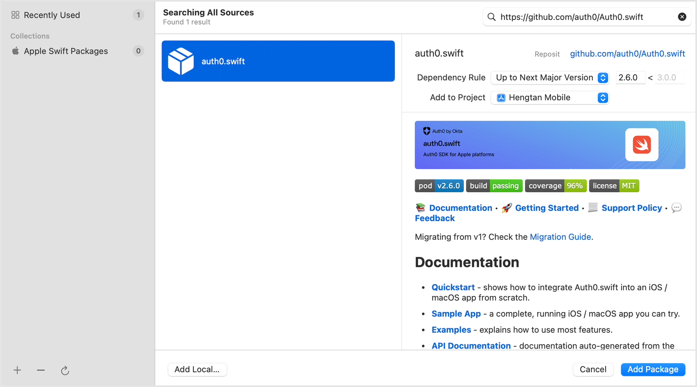
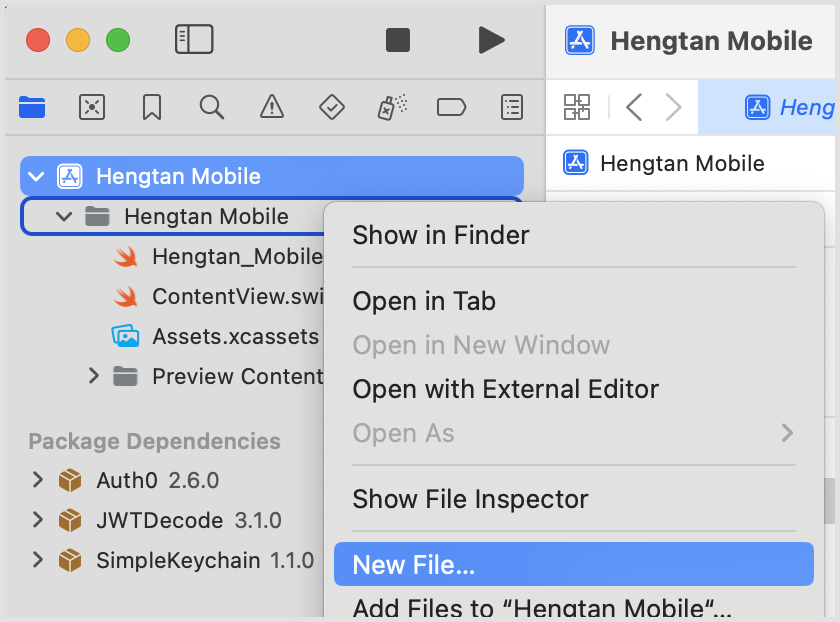
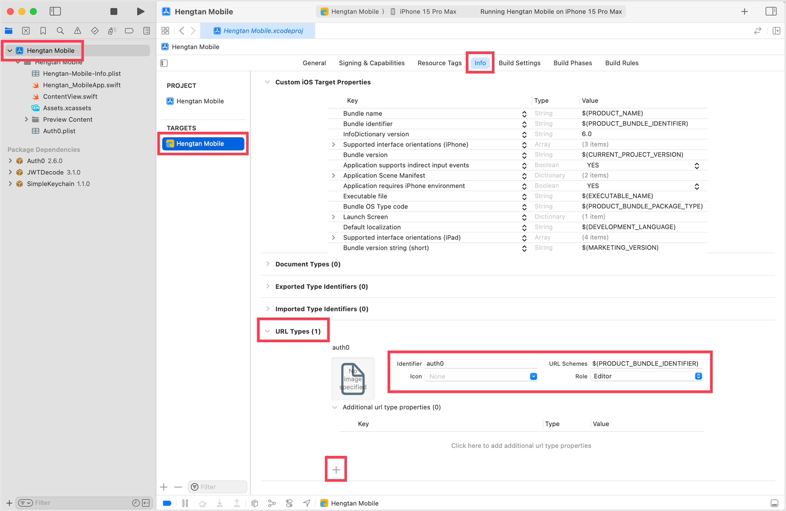
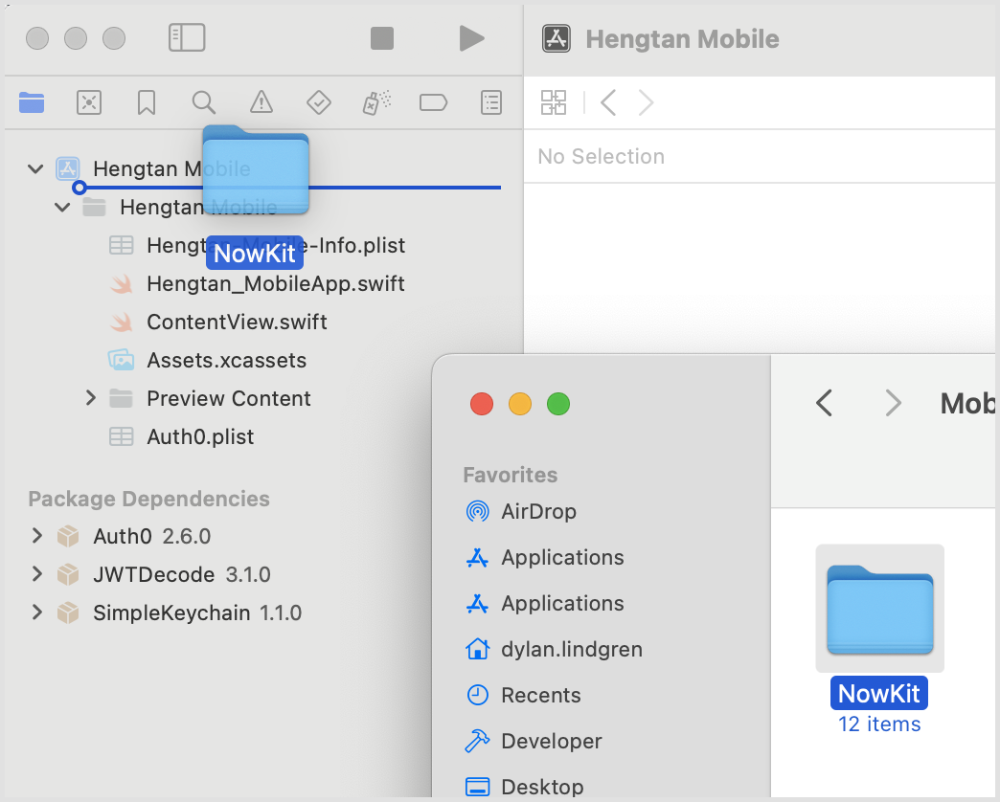
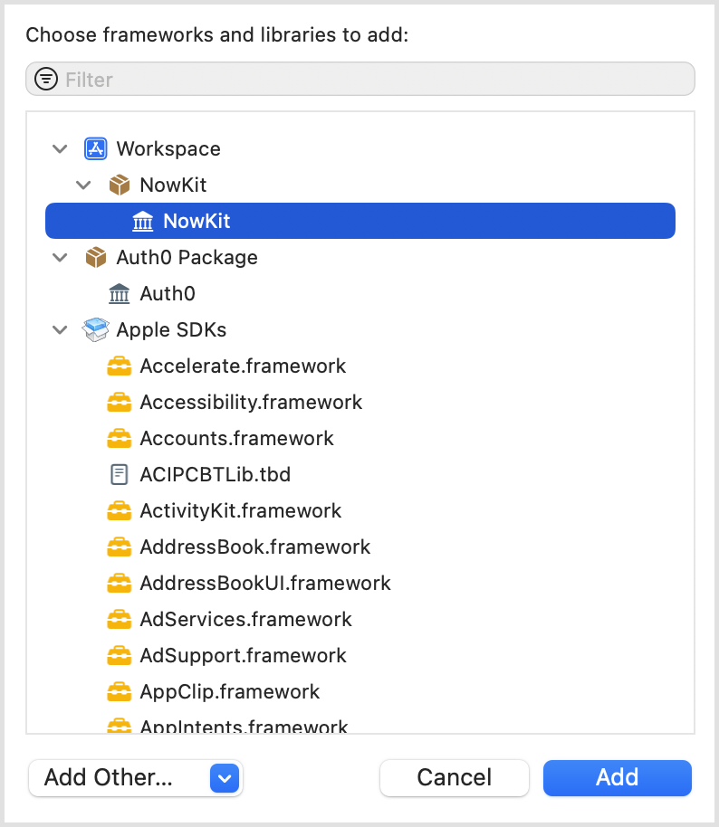
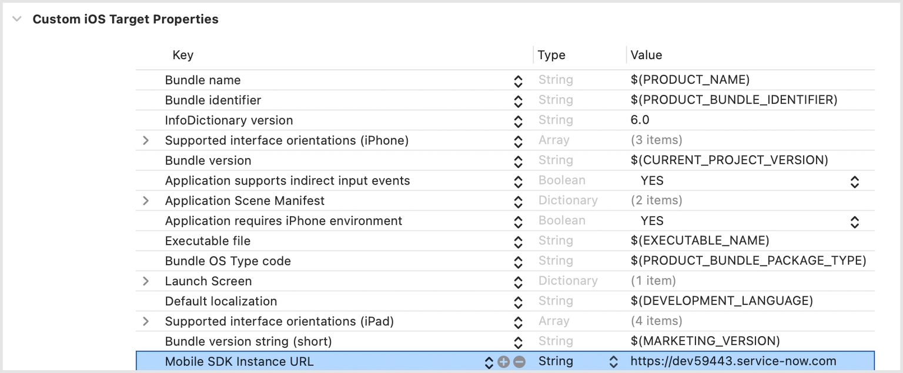

[](00-getting-started.md)

&nbsp;
# Lab Guidebook: Bring ServiceNow to life in your iOS app! A beginner's guide to the Mobile SDK

# 📦 Exercise 3: Frameworks, Libraries, & Packages
Packages, Libraries, and Frameworks in Xcode are all ways we can include external code and functionality in our applications. There are two of these that we need to include in our application before we get started with development.

- [Auth0 has a helpful SDK](https://auth0.com/docs/quickstart/native/ios-swift) allowing us to easily add the login functionality to our application.
- And then of course, we need to include the Mobile SDK so that we can use it in our application.

## 3.1 – Auth0 SDK
1. In **Xcode**, click **File** > **Add Package Dependencies...**
2. In the **Search or Enter Package URL** field enter this URL: `https://github.com/auth0/Auth0.swift`
3. Ensure **Auth0.swift** is selected in the search results, and press the **Add Package** button.

<br />
The "Add package dependencies" dialog in Xcode.

4. In the dialog that appears, once the download has completed, press the **Add Package** button.
5. Right-click on the top-level group in the project navigator (the one with the grey folder icon) and choose **New File...** from the list.

<br />
> Creating a new file in the Hengtan Mobile top-level group.

6. From the file types, select **Property List** from the **Resource** section, and click **Next**.

7. Name the file **Auth0.plist** and click **Create**.

8. Right-click on the **Auth0.plist** file in the project navigator, and choose **Open As** > **Source Code**.

9. Replace the file's contents with the following, replacing `YOUR_AUTH0_APP_CLIENT_ID` with the Client ID listed in the Settings tab of your native mobile app in Auth0 (we previously used this in step 2.4.7) and `YOUR_AUTH0_TENANT_DOMAIN` with your Auth0 tenant domain (we previously used this in step 2.2.6).

> [!NOTE]
> You can find both the Client ID and Domain to use here from within the Auth0 management console under Applications > [the native app you created] > Settings.

```xml
<?xml version="1.0" encoding="UTF-8"?>
<!DOCTYPE plist PUBLIC "-//Apple//DTD PLIST 1.0//EN" "http://www.apple.com/DTDs/PropertyList-1.0.dtd">
<plist version="1.0">
<dict>
    <key>ClientId</key>
    <string>YOUR_AUTH0_APP_CLIENT_ID</string>
    <key>Domain</key>
    <string>YOUR_AUTH0_TENANT_DOMAIN</string>
</dict>
</plist>
```

10. From the Xcode menu choose **File** > **Save**, or press **COMMAND + S** on your keyboard.

11. Select the top-most **Hengtan Mobile** item in the project navigator, select the **Hengtan Mobile** target, and choose the **Info** tab.

12. Expand the **URL Types** section and press the **[+]** button to add a new URL Scheme. Set `auth0` as the **Identifier** field, and set the **URL Schemes** value to `$(PRODUCT_BUNDLE_IDENTIFIER)`.

<br />
Creating a URL Type in our application

## 3.2 – Mobile SDK
1. Extract the **NowKit.zip** file from the lab files into a location on your machine. 

// TODO: Download Link

2. Drag and drop the extracted **NowKit** folder underneath the top-most **Hengtan Mobile** item in the project navigator.

<br />
Dragging the NowKit folder into the Hengtan Mobile project.

3. Select the top-most **Hengtan Mobile** item in the project navigator, select the **Hengtan Mobile** target, and choose the **General** tab.

4. In the **Frameworks, Libraries, and Embedded Content** section, press the **[+]** button.

5. Select **NowKit** from the list, and click **Add**.

<br />
Adding the NowKit library.

## 3.3 – Instance URL
Each of the different parts of the Mobile SDK require us to provide the instance URL for it to connect to. Instead of hard-coding that URL in multiple places across our application, we can store that in a single place using the steps below.

1. Select the top-most **Hengtan Mobile** item in the project navigator, select the **Hengtan Mobile** target, and choose the **Info** tab.

2. In the **Custom iOS Target Properties** section, click on the final item in the list and press the plus button.

3. A new item in the list will be created. Set the Key to `Mobile SDK Instance URL` and the value to the URL of your ServiceNow instance. For example, `https://MYINSTANCE.service-now.com`.

 <br />
The **Mobile SDK Instance URL** property after having been added.

<br /><br />

[](04-login-screen.md)