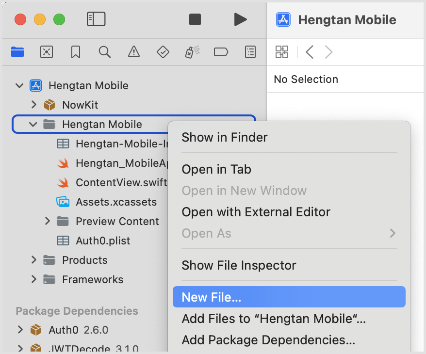
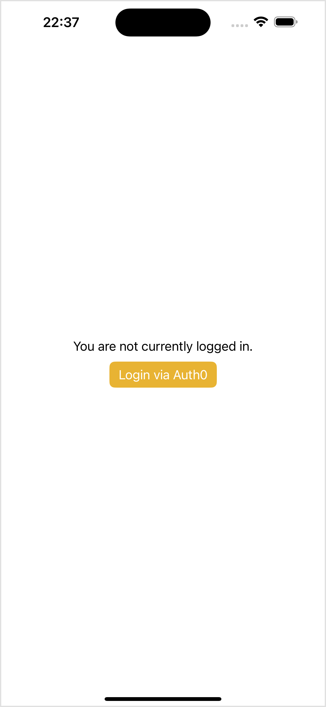
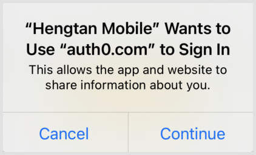
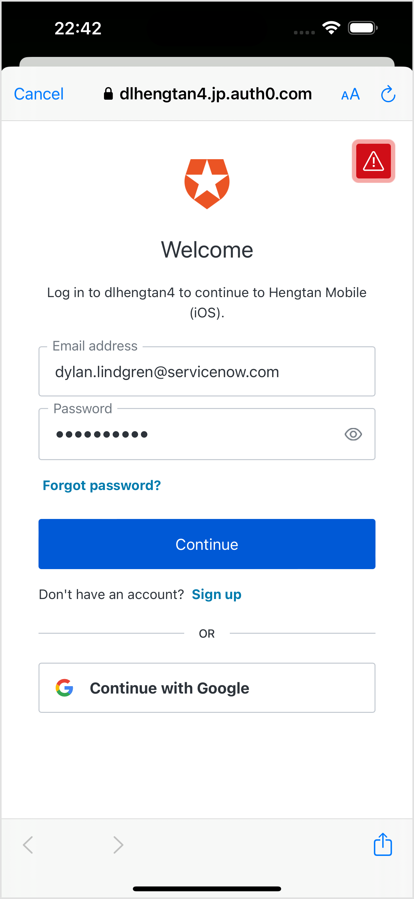
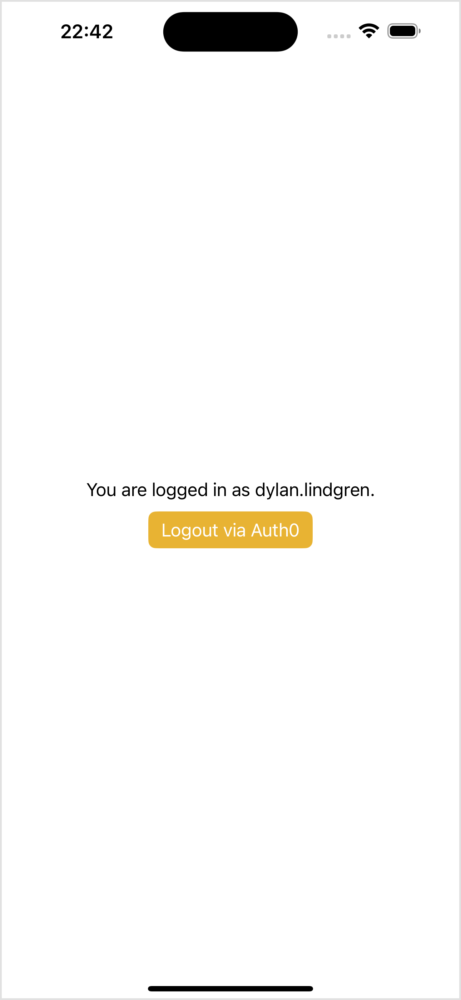

[](00-getting-started.md)

&nbsp;
# Lab Guidebook: Bring ServiceNow to life in your iOS app! A beginner's guide to the Mobile SDK

# 🛂 Exercise 4: Login Screen

As with most programming languages, it's best practice in Swift to separate your business logic from the way it is presented to users of your application. The [Model-View-ViewModel (MVVM) design pattern](https://en.wikipedia.org/wiki/Model%E2%80%93view%E2%80%93viewmodel) is the most common way of implementing this separation in iOS applications.

In the case of the authentication part of our application, we will create two files that allow us to acheive this.

### 4.1) Creating SDKManager
`SDKManager` will contain our business logic, allowing us to trigger the login and logout actions, and also to provide the token that the Mobile SDK will use to talk to the ServiceNow instance. It will also track the state of whether we are logged in or not.

1. Right-click on the **Hengtan Mobile** group in the project navigator (the one with the folder icon) and click **New File...** in the list.

	
	
2. Select **Swift File** and click **Next**.
3. Give the file the name **SDKManager.swift**, and click **Create**.
4. Replace the contents of the file with the following, and save it.

	```swift
	import Foundation
	import Auth0
	import JWTDecode
	
	class SDKManager: ObservableObject {
	
	    @Published private(set) var isLoggedIn: Bool = false
	
	    private(set) var idToken: String?
	    private(set) var accessToken: String?
	    private(set) var currentUser: String?
	
	    func login () {
	        Auth0
	            .webAuth()
	            .logging(enabled: true)
	            .start { result in
	            switch result {
	            case .success(let credentials):
	                
	                self.idToken = credentials.idToken
	                self.accessToken = credentials.accessToken
	                
	                do {
	                    let idToken = try decode(jwt: credentials.idToken)
	                    self.currentUser = idToken["nickname"].string
	                } catch {
	                    print("Couldn't decode idToken")
	                }
	                
	                DispatchQueue.main.async {
	                    self.objectWillChange.send()
	                    self.isLoggedIn = true
	                }
	                
	            case .failure(let error):
	                print("Failed with: \(error)")
	            }
	        }
	    }
	
	    func logout () {
	        Auth0
	            .webAuth()
	            .clearSession { result in
	            switch result {
	            case .success:
	                DispatchQueue.main.async {
	                    self.objectWillChange.send()
	                    self.isLoggedIn = false
	                }
	            case .failure(let error):
	                print("Failed with: \(error)")
	            }
	        }
	    }
	}
	
	```
	
    > [!NOTE]
    > This `SDKManager` class implements the `ObservableObject` protocol, which means that in other parts of our application we can react when it changes.
    >
    > This will be handy for example to watch the `isLoggedIn` property, so that when we log in we can unlock the features of the application only available when logged in.

    > [!NOTE]
    > We also have `login` and `logout` methods which interact with the `Auth0` object (part of the Auth0 SDK) to trigger these actions, and on completion update the relevant properties on our `SDKManager` class.

### 4.2) Creating SettingsView
SettingsView will contain the makeup of our login/logout user interface, as well as the code that will execute the functions in our SDKManager class.

1. Right-click on the **Hengtan Mobile** group in the project navigator (the one with the folder icon) and click **New File...** in the list.
2. Select **SwifUI View** and click **Next**.
3. Give the file the name **SettingsView.swift**, and click **Create**.
4. Replace the contents of the file with the following, and save it.

	```swift
	import SwiftUI
	
	struct SettingsView: View {
	    
	    @ObservedObject var sdkManager: SDKManager
	    
	    var body: some View {
	        VStack {
	            if sdkManager.isLoggedIn {
	            
	                Text("You are logged in as \(sdkManager.currentUser!).")
	                Button(action: sdkManager.logout, label: {
	                    Text("Logout via Auth0")
	                }).buttonStyle(.borderedProminent)
	                
	            } else {
	            
	                Text("You are not currently logged in.")
	                Button(action: sdkManager.login, label: {
	                    Text("Login via Auth0")
	                }).buttonStyle(.borderedProminent)
	                
	            }
	        }
	    }
	}
	```
	
> [!NOTE]
> As with all SwiftUI views, the SettingsView struct implements the `View` protocol (or an extension from it). That protocol states that it must have a `body` computed property that returns a `View`.
>
> From our `body` property we are returning a `VStack` (a type of view), and inside that we're using the `isLoggedIn` property on the `sdkManager` object to show the right text and button for whether we're logged in or not.

### 4.3) Add to ContentView
Now that we have our SettingsView view created, we can use it in our application.

1. In the project navigator, open the **ContentView.swift** file.
2. Replace the code inside the `VStack {...}` with `SettingsView(sdkManager: sdkManager)`.
3. Add `@ObservedObject var sdkManager = SDKManager()` within the body of the `ContentView` struct.
4. Save the file.

Your code should now look as follows:

```swift
import SwiftUI

struct ContentView: View {

    @ObservedObject var sdkManager = SDKManager()

    var body: some View {
        VStack {
            SettingsView(sdkManager: sdkManager)
        }
        .padding()
    }
}

struct ContentView_Previews: PreviewProvider {
    static var previews: some View {
        ContentView()
    }
}
```
	
> [!NOTE]
> In all SwiftUI applications the `ContentView` struct is the main entrypoint, and determines what a user sees within the application.
> 
> As with SettingsView, it implements the `View` prototcol and so it needs to return a `View` from its `body` computed property.
> 
> In this case, we're returning a `VStack` with `padding` around it, which contains our `SettingsView`.

### 4.4) Testing in Simulator

Press the  (play) button to run this project on your simulated iPhone 15 Pro Max.

You should first be taken to a screen showing the message saying that you are not loggged in, and the **Login via Auth0** button.



Click the **Login via Auth0** button, and you'll shown the regular prompt that Apple displays when doing web-based authentication in an iOS application. Click **Continue**.



You'll then be taken to the Auth0 login page. Login with the username and password of the user you created in Auth0 in [section 2.3](02-instance-authentication-sdk-connection.md#2.3) and click **Continue**.



Finally, if you entered the correct username and password you'll be logged in as that user! Yay!



You'll now see a message saying the nickname of the user you're logged in as, and a logout button.

Press the **Logout via Auth0** button to return to the login screen.

<br /><br />

[](05-connect-show-data.md)