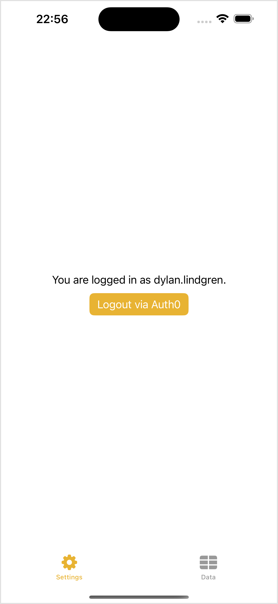
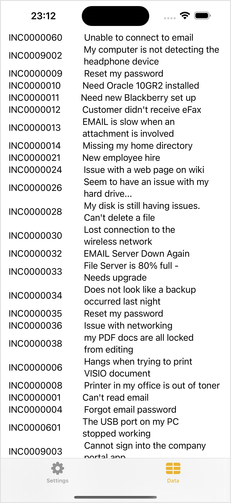

[](00-getting-started.md)

&nbsp;
# Lab Guidebook: Bring ServiceNow to life in your iOS app! A beginner's guide to the Mobile SDK

## 💾 Exercise 5: Connect To & Show Data

Now that we have our application logged into Auth0, we can supply the authentication tokens we received in the process to the Mobile SDK and start using its capabilities in our app.

The first capability we will use is NowData.

### 5.1) Edit SDKManager

Our `SDKManager` class currently handles authentication with Auth0, but we also want to allow it to handle the initialization and interaction with the Mobile SDK. This is the first time we're actually using the capabilities of the Mobile SDK in our app, so let's get that set up.

1. Double-click on **SDKManager.swift** in the project navigator to open it.
2. Add `import NowSDK` at the top of the file (below the other `import` statements).
3. Within the `SDKManager` class definition, add the below `init()` function code:

    ```swift
    init () {
        let logLevel: NowLogLevel = .debug
        let sdkConfig = NowSDKConfiguration(authorizationProvider: self,
                                            permissionDelegate: self,
                                            logLevel: logLevel)
        
        do {
            try NowSDK.configure(with: sdkConfig)
        } catch {
            print("Could not initialize NowSDK. Error: \(error.localizedDescription)")
        }
    }
    ```
        
    > [!NOTE]
    > In a Swift `class`/`struct` you can define an `init` method which will be executed when an object of this type is created. We're using this method to do the preparation work, readying the NowSDK for its use later on.
    
4. At the absolute bottom of the file (outside the `SDKManager` class definition) add the below extensions to the `SDKManager` class:

    ```swift
    extension SDKManager: NowSDKAuthorizationProviding {
        func requestAuthorization(for instanceUrl: URL, completion: @escaping ([AuthorizationToken]?) -> Void) {
            if let idToken = self.idToken {
                completion([AuthorizationToken(type: .jwt, token: idToken)])
            }
        }
    }

    extension SDKManager: DevicePermissionDelegate {
        func canRequestPermission(_ permission: DevicePermission) -> Bool {
            return true
        }
    }
    ```
        
    > [!NOTE]
    > In our `init` method we passed a reference to `self` (i.e. an `SDKManager` object) into `NowSDKConfiguration`'s `authorizationProvider` and `permissionDelegate` parameters.
    >
    > These two parameters expect what's passed in to conform to the `NowSDKAuthorizationProviding` and `DevicePermissionDelegate` protocols respectively, so we're extending `SDKManager` and adding conformance to those protocols.

### 5.2) Create DataModel

Now that we have the Mobile SDK initialized we can use it to retrieve data.

1. Right-click on the **Hengtan Mobile** group in the project navigator (the one with the folder icon) and click **New File...** in the list.
2. Select **Swift File** and click **Next**.
3. Give the file the name **DataModel.swift**, and click **Create**.
4. Replace the contents of the file with the following and save it.

    ```swift
    import Foundation
    import NowData
    import NowSDK

    class DataModel: ObservableObject {

        @Published var incidents: [Incident] = []

        private let instanceURL = URL(string: Bundle.main.object(forInfoDictionaryKey: "Mobile SDK Instance URL") as! String)!

        init () {
            makeTableService(instanceUrl: instanceURL) { result in
                switch result {
                case .success(let tableService):
                    tableService.records(from: "incident") { data in
                        let records = data.convertToRecords();
                        
                        switch records {
                        case .failure(let error):
                            print("There was an error: \(error)")
                        case .success(let convertedRecords):
                            var index = 0;
                            convertedRecords.forEach { record in
                                let incident = self.createIncident(fromRecord: record, withIndex: index)
                                index += 1
                                
                                DispatchQueue.main.async {
                                    self.incidents.append(incident)
                                }
                            }
                        }
                    }
                case .failure(let error):
                    debugPrint("Creating table service failed with error: \(error.localizedDescription)")
                }
            }
        }
        
        private func createIncident(fromRecord record: NowRecord, withIndex index: Int) -> Incident {
            
            var shortDescValue: String = ""
            if let shortDescField = record.fields.first(where: { $0.fieldName == "short_description" }) {
                shortDescValue = shortDescField.stringValue
            }
            
            var numberValue: String = ""
            if let numberField = record.fields.first(where: { $0.fieldName == "number" }) {
                numberValue = numberField.stringValue
            }
            
            return Incident(id: index,
                            sysId: record.sysId,
                            shortDescription: shortDescValue,
                            number: numberValue)
        }

    }

    struct Incident: Identifiable {
        var id: Int
        var sysId: SysID
        var shortDescription: String
        var number: String
    }
    ```

    > [!NOTE]
    > DataModel is once again an `ObservableObject`, meaning we can react to its changes in other parts of our application
    >
    > In its `init` method we're using the `makeTableService` function that's part of the Moile SDK to connect to the `incident` table on our instance and retrieve data from it.
    >
    > We're then looping through each of those records and creating an `Incident` object for each, which get placed into the `incidents` array.

### 5.3) Create DataView

Now that we have a way of retieving the data, we can create our view of that data.

1. Right-click on the **Hengtan Mobile** group in the project navigator (the one with the folder icon) and click **New File...** in the list.
2. Select **SwiftUI View** and click **Next**.
3. Give the file the name **DataView.swift**, and click **Create**.
4. Replace the contents of the file with the following, and save it.

    ```swift
    import SwiftUI

    struct DataView: View {
        
        @ObservedObject var dataModel: DataModel = DataModel()
        
        var body: some View {
            ScrollView {
                VStack (alignment: .leading) {
                    ForEach(dataModel.incidents) {inc in
                        HStack {
                            Text(inc.number).padding(.horizontal)
                            Text(inc.shortDescription).padding(.horizontal)
                        }
                            
                    }
                }
            }
        }
    }
    ```

    > [!NOTE]
    > We're returning a `ScrollView` from this `View` which allows us to scroll up and down if the content goes off the screen.
    >
    > We're looping over the `incidents` array on our `dataModel` object and putting the `number` and `shortDescription` of the incident on the screen as text.

### 5.4) Add to ContentView

Now that we have our DataView view created, we can use it in our application.

1. In the project navigator, open the **ContentView.swift** file.
2. Replace the `VStack` with a `TabView` as shown in the following code.

    ```swift
    var body: some View {
        TabView {
            SettingsView(sdkManager: sdkManager)
                .tabItem {
                Image(systemName: "gearshape")
                Text("Settings")
            }
        }
    }
    ```
	
3. Within the `TabView { ... }`, after the `SettingsView` add the below code:

    ```swift
    if (sdkManager.isLoggedIn) {
        DataView()
            .tabItem {
            Image(systemName: "tablecells")
            Text("Data")
        }
    }
    ```
	
4. Your `ContentView` file should now look like this:

    ```swift
    import SwiftUI

    struct ContentView: View {

        @ObservedObject var sdkManager = SDKManager()

        var body: some View {
            TabView {
                SettingsView(sdkManager: sdkManager)
                    .tabItem {
                    Image(systemName: "gearshape")
                    Text("Settings")
                }
                if (sdkManager.isLoggedIn) {
                    DataView()
                        .tabItem {
                        Image(systemName: "tablecells")
                        Text("Data")
                    }
                }
            }
        }
    }

    #Preview {
        ContentView()
    }
    ```

    > [!NOTE]
    > The `TabView` creates a tabbed interface like those you will have seen in other iOS applications, with the buttons horizontally positioned at the bottom of the screen.
    >
    > The `tabItem` method sets the content of that tab button (e.g. in this case, its icon and text).

### 5.5) Testing in Simulator

Press the  (play) button to run this project on your simulated iPhone 15 Pro Max.

You should first be taken to a screen showing the message saying that you are not loggged in, and the **Login via Auth0** button. Notice the addition of the tabs at the bottom of the page. Currently, the only tab showing is **Settings**, which is currently selected.

<br />
Settings is the only tab button showing.<br /><br />

When we login, we'll see the addition of a new tab at the bottom called **Data**.

<br />
After logging in, the Data tab button now shows.<br /><br />

When you press on the **Data** tab, it will switch to our DataView, which will show the list of Incident numbers and short descriptions.

<br />
A list of incidents retrieved from the instance by the Mobile SDK.<br /><br />


Finally, if we switch back to the **Settings** tab and press the **Logout via Auth0** button, the Data tab will disappear.

<br /><br />

[](06-add-virtual-agent.md)