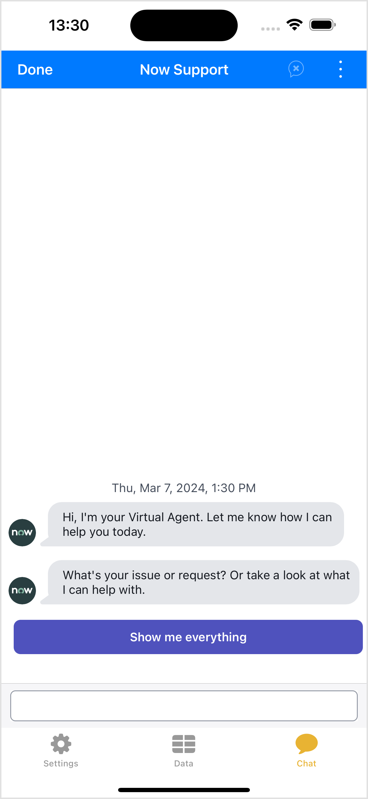

[](00-getting-started.md)

&nbsp;
# Lab Guidebook: Bring ServiceNow to life in your iOS app! A beginner's guide to the Mobile SDK
## 💬 Exercise 6: Add Virtual Agent

While it is perfectly conceiveable people would want to create their own UI for a list of incidents for example, to re-develop the entire Vitual Agent interface is quite unnecessary. Adding Virtual Agent to our application is the first part of our app where we will be using capabilities of the Mobile SDK that create the UI for us. 

Prior to Swift and SwiftUI, iOS applications were created in Objective-C and UIKit. Sometimes you will come across libraries that use Objective-C/UIKit and have to leverage them in your Swift/SwiftUI applications. NowChat is one of these libraries.

### 6.1) Create ChatModel

1. Right-click on the **Hengtan Mobile** group in the project navigator (the one with the folder icon) and click **New File...** in the list.
2. Select **Swift File** and click **Next**.
3. Give the file the name **ChatModel.swift**, and click **Create**.
4. Replace the contents of the file with the following save it.

```swift
import Foundation
import NowChat
import UIKit
import NowSDK

class ChatModel: ObservableObject {

    var chatService: NowChatService?
    var chatServiceDelegate: NowChatServiceDelegate
    
    private let instanceURL = URL(string: Bundle.main.object(forInfoDictionaryKey: "Mobile SDK Instance URL") as! String)!

    init () {
        chatServiceDelegate = ChatServiceDelegate()

        makeChatService(instanceUrl: instanceURL, delegate: chatServiceDelegate) { result in
            switch result {
            case .success(let chatService):
                self.chatService = chatService
                debugPrint("Made chat service \(chatService)")
            case .failure(let error):
                debugPrint("Chat service creation failed with error: \(error)")
            } }
    }

    func makeChatScreen() -> UIViewController? {
        guard let chatService = chatService else { return nil }
        let result = chatService.makeChatUI(theme: HengtanChatTheme(baseTheme: HengtanTheme()))
        switch result {
        case .success(let chatViewController):
            let _ = chatService.startChat()
            return chatViewController
        case .failure(let error):
            print("Chat screen creation failed with error: \(error)")
            return nil
        }
    }
    
    class ChatServiceDelegate: NowChatServiceDelegate {
        func chatService(_ chatService: NowChat.NowChatService, didRequestOpenUrl url: URL) {
            print("didRequestOpenUrl")
        }

        func chatServiceViewControllerWasDismissed(_ chatService: NowChat.NowChatService) {
            print("chatServiceViewControllerWasDismissed")
        }
    }
}

struct HengtanTheme: NowUIThemeable {
    var color: NowUIColoring = Color()

    struct Color: NowUIColoring {
        var brand: UIColor { adaptiveColor(UIColor.systemBlue, .systemGray) }
        var linkText: UIColor { brand }
    }
}

struct HengtanChatTheme: NowChatThemeable {
    var color: NowChatColoring

    struct Color: NowChatColoring {
        var nowUIColor: NowUIColoring

        var background: UIColor { UIColor.systemGroupedBackground }
        var headerBackground: UIColor { nowUIColor.brand }
        var headerText: UIColor { UIColor.white }
        var menuIcon: UIColor { nowUIColor.brand }
        var buttonBackground: UIColor { nowUIColor.brand }
        var buttonText: UIColor { UIColor.white }
        var botBubbleBackground: UIColor { UIColor.systemGray5 }
        var botBubbleText: UIColor { nowUIColor.textPrimary }
        var agentBubbleBackground: UIColor { UIColor.systemGray5 }
        var agentBubbleText: UIColor { nowUIColor.textPrimary }
        var bubbleBackground: UIColor { UIColor.systemGray4 }
        var bubbleText: UIColor { nowUIColor.textPrimary }

        init(baseColors: NowUIColoring) {
            nowUIColor = baseColors
        }
    }

    init(baseTheme: NowUIThemeable) {
        color = Color(baseColors: baseTheme.color)
    }
}
```

> [!NOTE]
> NowChat handles both the data and UI aspects of the chat interface, so while the `init` method looks similar to the one we created for NowData, we also have the additional `makeChatScreen` method. From that we're returning a `UIViewController` which allows us to render the Virtual Agent UI.

> [!NOTE]
> The Virtual Agent UI created by NowChat will alter its theme based on the `theme` property passed into it, which we are using the `HengtanTheme` and `HengtanChatTheme` structs to create the value for.

### 6.2) Create ChatView

1. Right-click on the **Hengtan Mobile** group in the project navigator (the one with the folder icon) and click **New File...** in the list.
2. Select **SwiftUI View** and click **Next**.
3. Give the file the name **ChatView.swift**, and click **Create**.
4. Replace the contents of the file with the following, and save it.

```swift
import SwiftUI

struct ChatView: UIViewControllerRepresentable {
    typealias UIViewControllerType = UIViewController
    
    var chatModel = ChatModel()
    
    func makeUIViewController(context: Context) -> UIViewController {
        return chatModel.makeChatScreen() ?? UIViewController()
    }
    
    func updateUIViewController(_ uiViewController: UIViewController, context: Context) {
        // Updates the state of the specified view controller with new information from SwiftUI.
    }
}
```

> [!NOTE]
> To display a UIKit view inside a Swift application the view needs to implement the `UIViewControllerRepresentable` protocol.
> 
> That protocol means it must have a `makeUIViewController` method which returns a `UIViewController`. We are getting this from the `makeChatScreen` metod of our `ChatModel`.

### 6.3) Add to ContentView

Now that we have our ChatView view created, we can use it in our application.

1. In the project navigator, open the **ContentView.swift** file.
2. Within the `TabView { ... }`, after the `DataView` add the below code:

```swift
ChatView()
.tabItem {
    Image(systemName: "message")
    Text("Chat")
}
```

Your `ContentView` file should now look like this:

```swift
import SwiftUI

struct ContentView: View {

    @ObservedObject var sdkManager = SDKManager()

    var body: some View {
        TabView {
            LoginLogoutView(sdkManager: sdkManager)
            .tabItem {
                Image(systemName: "gearshape")
                Text("Settings")
            }
            if (sdkManager.isLoggedIn) {
                DataView()
                .tabItem {
                    Image(systemName: "tablecells")
                    Text("Data")
                }
                ChatView()
                .tabItem {
                    Image(systemName: "message")
                    Text("Chat")
                }
            }
        }
    }
}

#Preview {
    ContentView()
}
```

### 6.4) Testing in Simulator

Press the  (play) button to run this project on your simulated iPhone 15 Pro Max.

After logging in, you'll now have an additional **Chat** tab at the bottom. Press it to show the **ChatView** we created, with the full Virtual Agent user interface embedded within our application!

<br />
The Virtual Agent UI inside our application.

<br /><br />

[](07-embed-service-portal.md)