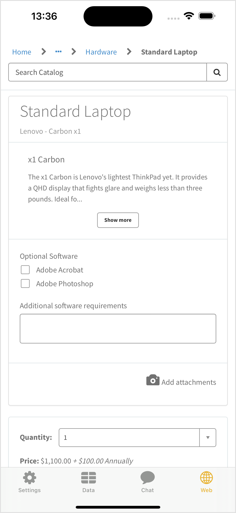

[](00-getting-started.md)

&nbsp;
# Lab Guidebook: Bring ServiceNow to life in your iOS app! A beginner's guide to the Mobile SDK
## 🌐 Exercise 7: Embed a Service Portal Page

Similar to NowChat, the NowWeb component of the Mobile SDK uses Objective-C/UI Kit, so we can leverage it in a similar way.

### 7.1) Create PortalPageModel

1. Right-click on the **Hengtan Mobile** group in the project navigator (the one with the folder icon) and click **New File...** in the list.
2. Select **Swift File** and click **Next**.
3. Give the file the name **PortalPageModel.swift**, and click **Create**.
4. Replace the contents of the file with the following and save it.

    ```swift
    import Foundation
    import NowWeb

    class PortalPageModel {
        
        var webService: NowWebService?
        var webServiceDelegate: WebServiceDelegate
        
        var instanceUrl = Bundle.main.object(forInfoDictionaryKey: "Mobile SDK Instance URL") as! String
        var instancePath = "/mesp?id=sc_cat_item&sys_id=04b7e94b4f7b4200086eeed18110c7fd"
        
        init () {
            
            webServiceDelegate = WebServiceDelegate()
            
            makeWebService(instanceUrl: URL(string: instanceUrl)!) { result in
                switch result {
                case .success(let webService):
                    self.webService = webService
                case .failure(let error):
                    print("Web service creation failed with error: \(error)")
                }
            }
        }
        
        func makeWebScreen() -> NowWeb.NowWebViewController? {
            guard let webService = webService else { return nil }
            let result = webService.makeWebViewController(for: URL(string:"\(instanceUrl)\(instancePath)")!,
                                                        delegate: webServiceDelegate)
            switch result {
                case .success(let webViewController):
                    let _ = webViewController.loadPage()
                    return webViewController
                case .failure(let error):
                    debugPrint("Web screen creation failed with error: \(error)")
                    return nil
            }
        }
        
        class WebServiceDelegate: NowWebViewControllerDelegate {
            func nowWebViewController(_ nowWebViewController: NowWeb.NowWebViewController, didEndFlow flowName: String) {
                print("didEndFlow")
            }
            
            func nowWebViewController(_ nowWebViewController: NowWeb.NowWebViewController, didFailNavigationWith error: Error) {
                print("didFailNavigationWith")
            }
            
            func nowWebViewController(_ nowWebViewController: NowWeb.NowWebViewController, didReceive unsupportedUrl: URL) {
                print("didReceive")
            }
            
            func nowWebViewControllerDidRequestDismissal(_ nowWebViewController: NowWeb.NowWebViewController) {
                print("nowWebViewControllerDidRequestDismissal")
            }
        }
    }

    ```

    > [!NOTE]
    > NowWeb also handles both the data and UI aspects, so have a similar `makeWebScreen` method to what we had for `ChatModel`.
    >
    > The `instancePath` variable contains the relative URL to a page on the instance that you want to load inside the application. The default page here (`/$sp.do?id=sc_cat_item&sys_id=04b7e94b4f7b4200086eeed18110c7fd`) is a good sample page that shows the "Standard Laptop" Service Catalog item that's available in any instance with demo data installed.
    >
    > The `WebServiceDelegate` class allows us to react to events that happen to the web view, and we create an instance of it within our init method and pass it in to the `makeWebViewController` method's `delegate` parameter.

### 7.2) Create PortalPageView

1. Right-click on the **Hengtan Mobile** group in the project navigator (the one with the folder icon) and click **New File...** in the list.
2. Select **SwiftUI View** and click **Next**.
3. Give the file the name **PortalPageView.swift**, and click **Create**.
4. Replace the contents of the file with the following, and save it.
    ```swift
    import SwiftUI
    import NowWeb

    struct PortalPageView: UIViewControllerRepresentable {
        typealias UIViewControllerType = NowWebViewController
        
        let portalPageModel = PortalPageModel()
        
        func makeUIViewController(context: Context) -> NowWeb.NowWebViewController {
            return portalPageModel.makeWebScreen()!
        }
        
        func updateUIViewController(_ uiViewController: NowWeb.NowWebViewController, context: Context) {
            // Updates the state of the specified view controller with new information from SwiftUI.
        }
    }
    ```

    > [!NOTE]
    > In the same way as with `ChatView`, the `PortalPageView` struct implements the `UIViewControllerRepresentable` protocol and returns a `UIViewController` from its `makeUIViewController` method.

### 7.3) Add to ContentView

Now that we have our `PortalPageView` view created, we can use it in our application.

1. In the project navigator, open the **ContentView.swift** file.
2. Within the `TabView { ... }`, after the `ChatView` add the below code:
    ```swift
    NavigationStack {
        PortalPageView()
    }
    .tabItem {
        Image(systemName: "globe")
        Text("Web")
    }
    ```

4. Your `ContentView` file should now look like this:
    ```swift
    import SwiftUI

    struct ContentView: View {

        @ObservedObject var sdkManager = SDKManager()

        var body: some View {
            TabView {
                LoginLogoutView(sdkManager: sdkManager)
                .tabItem {
                    Image(systemName: "gearshape")
                    Text("Settings")
                }
                if (sdkManager.isLoggedIn) {
                    DataView()
                    .tabItem {
                        Image(systemName: "tablecells")
                        Text("Data")
                    }
                    ChatView()
                    .tabItem {
                        Image(systemName: "message")
                        Text("Chat")
                    }
                    NavigationStack {
                        PortalPageView()
                    }
                    .tabItem {
                        Image(systemName: "globe")
                        Text("Web")
                    }
                }
            }
        }
    }

    #Preview {
        ContentView()
    }
    ```

    > [!NOTE]
    > Service Portal pages embedded in your application using NowWeb have available to them almost all the integration functionality as pages embedded in the official ServiceNow native applications. This integration functionality is delivered using the [Cabrillo API](https://docs.servicenow.com/bundle/washingtondc-api-reference/page/app-store/dev_portal/API_reference/Cabrillo-client/concept/cabrillo-namespace.html) in Service Portal.
    > 
    > The reason we've wrapped the `PortalPageView` inside a `NavigationStack` is so that calls to the `cabrillo.viewLayout` functions will work.
    > 
    > For example, when accessing a catalog item via the **Moble Employee Service Portal** (`/mesp`), instead of placing the "Order" buttons inside the web page it calls `cabrillo.viewLayout.setBottomButtons()` to add native buttons to the application interface. `NavigationStack` allows these buttons to be placed inside our application.

### 7.4) Testing in Simulator

Press the  (play) button to run this project on your simulated iPhone 15 Pro Max.

After logging in, you'll now have an additional **Web** tab at the bottom. Press it to show the `PortalPageView` we created, showing the Service Portal page you specified inside your `PortalPageModel` file!

<br />
A Service Portal page embedded in our mobile app.

<br /><br />

[](08-further-resources.md)